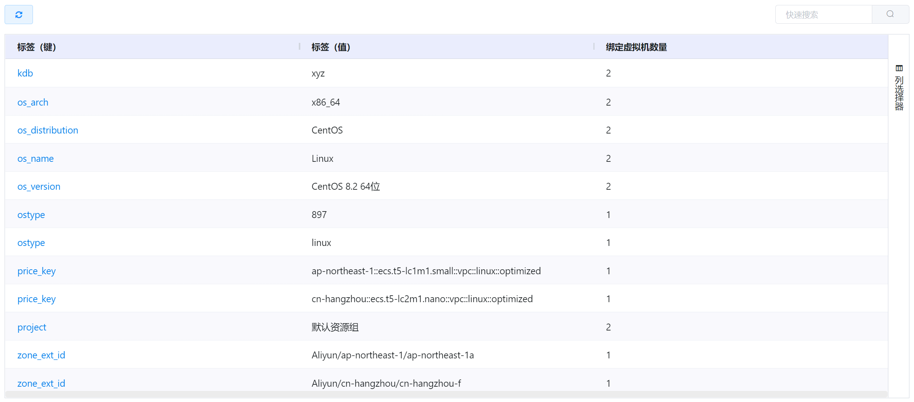
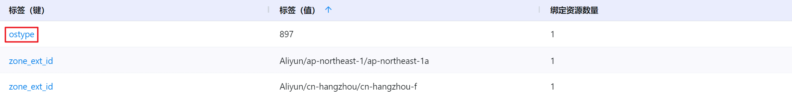
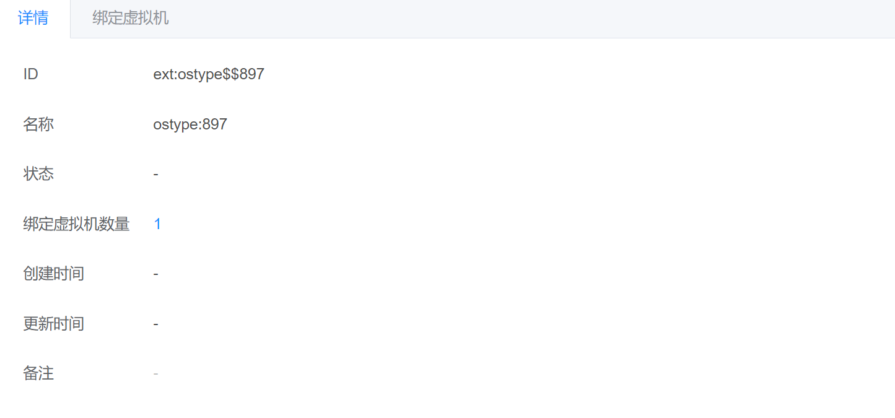
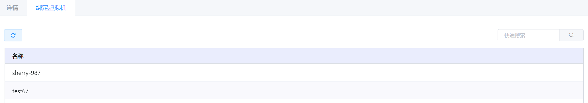

# 5.5.2.公有云标签管理

公有云的资源标签适用于使用场景设置虚拟机的归类标签。

在创建虚拟机时，用户可以勾选现有的资源标签，也可以新建标签，选择后填写标签的键值，关联到虚拟机上。

用户可以从企业管理->资源标签->阿里云标签中，查看当前平台中现存的标签情况，和标签关联虚拟机情况。

在“企业管理”菜单下选择左侧“资源标签”导航菜单，之后点击“公有云标签”的子菜单即可看到公有云标签的管理界面：

[!NOTE]

- 云平台创建、编辑资源标签的入口为创建虚拟机和虚拟机详情页面；
- 目前云平台仅支持公有云标签的新增，不提供标签的删除功能。

## 相关操作

HYPERX云管理平台支持用户对公有云的资源标签进行管理，支持的功能如下：

- 快速搜索：根据公有云资源标签的名称字段全局快速搜索资源标签；
- 高级筛选：用户可以从表头右侧根据公有云标签键、值、绑定虚拟机数量等字段筛选出符合条件的资源标签；
- 查看标签信息：用户可以查看选定公有云标签的相关信息和绑定虚拟机的详细情况。

操作入口如下：

- 企业管理→资源标签→公有云标签

## 操作说明

### 查看标签信息

① 在公有云标签的管理界面中，点击公有云标签名称，可以进入公有云标签详情：

② 详情页面展示了资源标签的的ID、名称、绑定资源数量等信息：

③ 进入"绑定虚拟机"子选项卡，或点击"绑定资源数量"的数字，即可看到选定资源标签关联虚拟机的情况：

